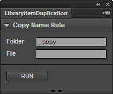

LibraryItemDuplication
=======

Flash CC ライブラリ内 選択したアイテムを一括で複製します。

---
## Download (Flash Pro CC)

* [LibraryItemDuplication.zxp](https://raw.github.com/siratama/LibraryItemDuplication/master/download/LibraryItemDuplication.zxp)

This can be used by Flash CC 13.1 or later. In the case of Windows, it can save from a right-click. 
[Extension Manager Command Line tool(ExManCmd)](https://www.adobeexchange.com/resources/28) is required in order to install. 

Flash CC 13.1 以降のバージョンで利用可能です。Windows の場合、右クリックから「リンク先のコンテンツを保存」を選択で保存できます。
インストールには別途 [Extension Manager Command Line tool(ExManCmd)](https://www.adobeexchange.com/resources/28)が必要です。

---
## Download (JSFL)

* [LibraryItemDuplication.jsfl](https://raw.github.com/siratama/LibraryItemDuplication/master/download/LibraryItemDuplication.jsfl)

